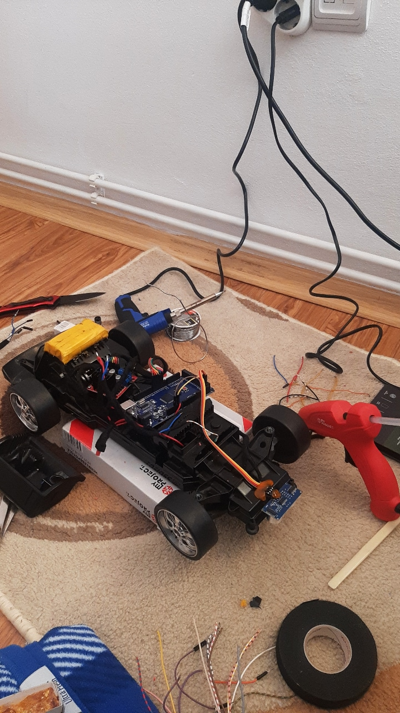
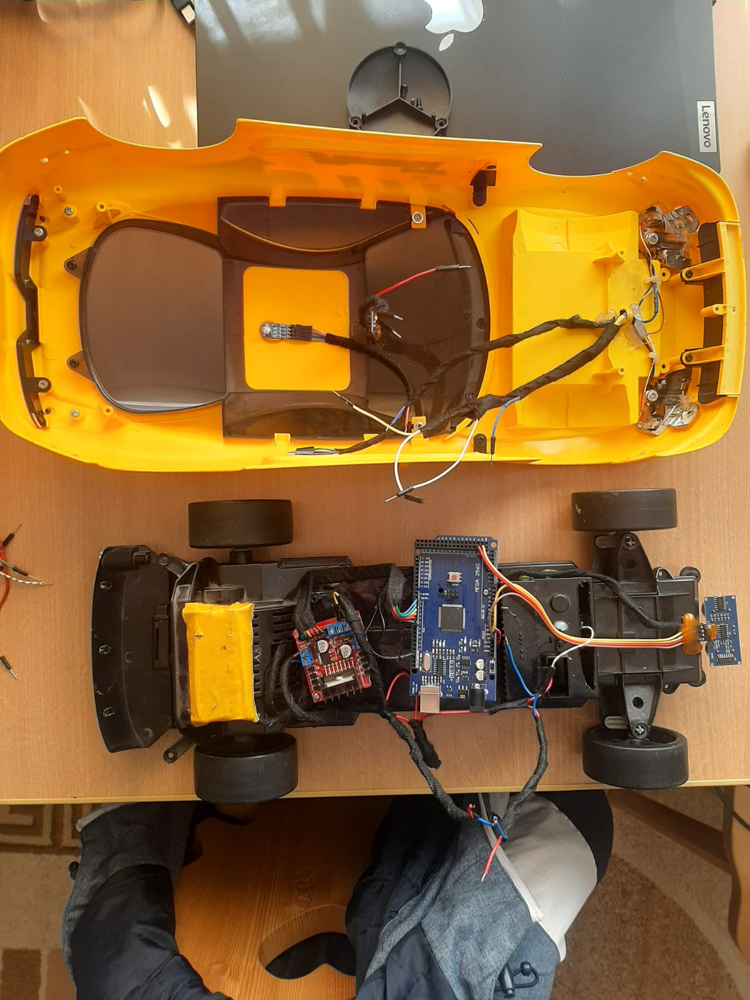

# arduino_car
Designed my first Arduino car, controlled using a mobile app via Bluetooth.

<h1>Design of the circuit</h1>

The design of the car is extremely simple, but it includes quite a large number of functionalities. This circuit is based on several components, such as: 
  <ul>
    <li>
  An Arduino Mega 2560 development board (chosen due to the large number of analog and digital pins)
    </li>
    <li>
  an H Bridge circuit (used to direct current to the car's motors, which control the rotation of the wheels) 
    </li>
    <li>
  a photoresistor sensor (used to turn on car lights if it's dark outside)
    </li>
  <li>
  2 batteries with voltage of 3.7V 
    </li>
    <li>
  one battery of 9.6V
    </li>
  <li>
  4 LED bulbs
    </li>
    <li>
  an ultrasonic sensor 
    </li>
  <li>
  a Bluetooth module
    </li>
  </ul>
   Also, the car has a charging port, used to charge the 3 batteries. 

 
 <h2>Circuit Diagram</h2>

 

<h1>Assembly of hardware components</h1>
  

